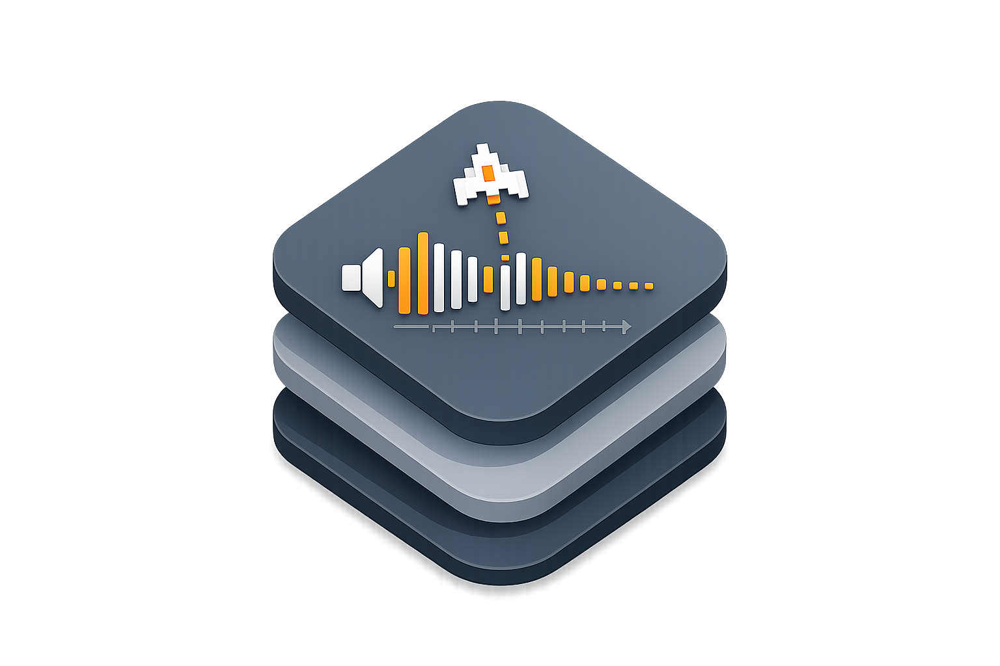

# ArcadeAudioKit

<p align="center">
  
</p>

[](https://swift.org)

[](LICENSE)

Recipe-first sound-effect modeling and deterministic mono PCM rendering for Swift packages and Apple-platform games.

ArcadeAudioKit provides:
- Musical note models using scientific pitch notation, such as `A4`, `F#5`, and `Bb4`.
- Pitch movement models for constant notes, explicit Hz values, sweeps, and progress/intensity interpolation.
- Timed waveform segments with duration, loudness, attack, and decay.
- Repeated motifs for short generated tails and loops.
- A deterministic mono `Float` PCM renderer.

v1 scope is recipe modeling and rendering only. Audio playback, audio sessions, mixing policy, logging, accessibility behavior, app-specific cue IDs, and AVFoundation integration are intentionally out of scope.

## Requirements

| Item | Requirement |
| --- | --- |
| Swift tools | 6.2+ |
| iOS | 18+ |
| macOS | 12+ |
| tvOS | 18+ |
| watchOS | 11+ |
| visionOS | 2+ |
| Dependencies | None |

## Installation

Add ArcadeAudioKit to your `Package.swift` dependencies:

```swift
dependencies: [
    .package(url: "https://github.com/dadederk/ArcadeAudioKit.git", from: "0.1.0")
]
```

Then add the product to your target:

```swift
target(
    name: "YourGame",
    dependencies: [
        .product(name: "ArcadeAudioKit", package: "ArcadeAudioKit")
    ]
)
```

For sibling-package development, temporarily replace the remote dependency with `.package(path: "../ArcadeAudioKit")`.

## Core Concepts

A recipe is a short sequence of sound segments. Each segment chooses:

- a waveform: sine, triangle, or square;
- a pitch: note, Hz value, note sweep, Hz sweep, or interpolated progress/intensity pitch;
- timing: duration, attack, and decay in milliseconds;
- loudness as an amplitude percentage.

Notes use scientific pitch notation, such as `A4`, `F#5`, or `Bb4`. Hz values remain available for legacy tuning and non-musical effects.

## Runtime and Audio Boundaries

- ArcadeAudioKit renders deterministic mono PCM samples from recipe data.
- It does not configure audio sessions, start audio engines, own player nodes, or choose mixing and interruption policy.
- It does not own logging, accessibility behavior, app-specific cue IDs, or user-facing audio settings.
- Consuming apps decide how rendered samples become buffers, files, previews, or live gameplay audio.

## Quick Start

```swift
import ArcadeAudioKit

let recipe = AudioRecipe(segments: [
    AudioSegment(
        waveform: .triangle,
        pitch: .sweep(start: .a3, end: .d4),
        durationMilliseconds: 110,
        amplitudePercent: 12,
        attackMilliseconds: 4,
        decayMilliseconds: 60
    ),
])

let samples = AudioPCMRenderer.render(recipe: recipe, sampleRate: 44_100)
```

The returned samples are mono `Float` PCM values bounded to `-1...1`. Consumers are responsible for converting those samples into platform audio buffers and deciding playback, session, mixing, interruption, logging, and accessibility policy.

Progress/intensity example:

```swift
let progress = 0.75
let segment = AudioSegment(
    waveform: .sine,
    pitch: .interpolatedConstant(lower: .c5, upper: .g5, amount: progress),
    durationMilliseconds: 60,
    amplitudePercent: 10,
    attackMilliseconds: 3,
    decayMilliseconds: 35
)
```

## API Overview

- `AudioNote`: scientific pitch notation and `A4 = 440` frequency conversion.
- `AudioWaveform`: `.sine`, `.triangle`, and `.square`.
- `AudioPitch`: constant notes, explicit Hz values, sweeps, and interpolated pitch motion.
- `AudioSegment`: one timed waveform building block.
- `AudioRepeatedMotif`: repeated segment groups for generated tails.
- `AudioRecipe`: ordered segments plus an optional repeated motif.
- `AudioPCMRenderer.render(recipe:pitchCents:sampleRate:)`: deterministic mono PCM rendering.
- Note-first summary helpers for preview tools and recipe screens.

## Real-World Example: RetroRapid Crash Cue

[RetroRapid](https://accessibilityupto11.com/apps/retrorapid/) uses ArcadeAudioKit recipes for its generated game effects. Its crash cue is built as a sharp square-wave impact, a descending triangle downturn, and a repeated low tail:

[Listen to the generated crash cue](audio/retrorapid-crash.wav), or open the [MP4 sample](audio/retrorapid-crash.mp4).

The WAV file is rendered from the recipe below and can be regenerated from [Examples/retrorapid-crash.recipe.json](Examples/retrorapid-crash.recipe.json) with the recipe renderer.

```swift
import ArcadeAudioKit

func makeCrashRecipe(tailRepeatCount: Int = 3) -> AudioRecipe {
    let impact = [
        AudioSegment(
            waveform: .square,
            pitch: .constantHz(330),
            durationMilliseconds: 120,
            amplitudePercent: 24,
            attackMilliseconds: 2,
            decayMilliseconds: 18
        ),
        AudioSegment(
            waveform: .square,
            pitch: .constantHz(277.18),
            durationMilliseconds: 120,
            amplitudePercent: 24,
            attackMilliseconds: 2,
            decayMilliseconds: 20
        )
    ]

    let downturn = [
        AudioSegment(
            waveform: .triangle,
            pitch: .sweepHz(startHz: 260, endHz: 220),
            durationMilliseconds: 150,
            amplitudePercent: 22,
            attackMilliseconds: 2,
            decayMilliseconds: 20
        ),
        AudioSegment(
            waveform: .triangle,
            pitch: .sweepHz(startHz: 220, endHz: 185),
            durationMilliseconds: 150,
            amplitudePercent: 22,
            attackMilliseconds: 2,
            decayMilliseconds: 20
        ),
        AudioSegment(
            waveform: .triangle,
            pitch: .sweepHz(startHz: 185, endHz: 155),
            durationMilliseconds: 160,
            amplitudePercent: 21,
            attackMilliseconds: 2,
            decayMilliseconds: 22
        ),
        AudioSegment(
            waveform: .triangle,
            pitch: .sweepHz(startHz: 155, endHz: 130),
            durationMilliseconds: 160,
            amplitudePercent: 20,
            attackMilliseconds: 2,
            decayMilliseconds: 22
        )
    ]

    let tail = AudioRepeatedMotif(
        segments: [
            AudioSegment(
                waveform: .triangle,
                pitch: .sweepHz(startHz: 130, endHz: 118),
                durationMilliseconds: 180,
                amplitudePercent: 18,
                attackMilliseconds: 2,
                decayMilliseconds: 28
            ),
            AudioSegment(
                waveform: .triangle,
                pitch: .sweepHz(startHz: 118, endHz: 104),
                durationMilliseconds: 160,
                amplitudePercent: 16,
                attackMilliseconds: 2,
                decayMilliseconds: 30
            )
        ],
        repeatCount: tailRepeatCount
    )

    return AudioRecipe(segments: impact + downturn, repeatedMotif: tail)
}
```

ArcadeAudioKit then turns the recipe into deterministic mono PCM. Playback stays in the app layer; for example, a consumer using AVFoundation can copy the rendered samples into an `AVAudioPCMBuffer`:

```swift
import AVFoundation
import ArcadeAudioKit

func makeBuffer(recipe: AudioRecipe, format: AVAudioFormat) -> AVAudioPCMBuffer? {
    let samples = AudioPCMRenderer.render(
        recipe: recipe,
        sampleRate: format.sampleRate
    )
    guard samples.isEmpty == false,
          let buffer = AVAudioPCMBuffer(
            pcmFormat: format,
            frameCapacity: AVAudioFrameCount(samples.count)
          ),
          let channel = buffer.floatChannelData?[0] else {
        return nil
    }

    buffer.frameLength = AVAudioFrameCount(samples.count)
    samples.withUnsafeBufferPointer { source in
        if let baseAddress = source.baseAddress {
            channel.update(from: baseAddress, count: samples.count)
        }
    }
    return buffer
}
```

For a minimal AVFoundation player, create an engine, schedule the buffer, and start the player node in the app layer:

```swift
final class RecipePreviewPlayer {
    private let engine = AVAudioEngine()
    private let player = AVAudioPlayerNode()
    private let format = AVAudioFormat(
        standardFormatWithSampleRate: 44_100,
        channels: 1
    )!

    init() throws {
        engine.attach(player)
        engine.connect(player, to: engine.mainMixerNode, format: format)
        try engine.start()
    }

    func play(recipe: AudioRecipe) {
        guard let buffer = makeBuffer(recipe: recipe, format: format) else {
            return
        }

        player.stop()
        player.scheduleBuffer(buffer, at: nil, options: [.interrupts])
        player.play()
    }
}
```

[RetroRapid](https://accessibilityupto11.com/apps/retrorapid/) schedules that buffer on its own `AVAudioPlayerNode` when a crash is detected, while ArcadeAudioKit remains responsible only for recipe modeling and sample rendering.

## Apps Using ArcadeAudioKit

- [RetroRapid!](https://accessibilityupto11.com/apps/retrorapid/) - play the game and hear sounds composed with ArcadeAudioKit.
- Let us know if you'd like your app to be listed here.

## Architecture

For a diagram-first view of the recipe model, renderer flow, command-line renderer, and consuming-app boundary, see [ARCHITECTURE.md](ARCHITECTURE.md).

## Xcode Integration

1. In Xcode, open your project and select `File > Add Package Dependencies...`
2. Enter `https://github.com/dadederk/ArcadeAudioKit.git`.
3. Add the `ArcadeAudioKit` library product to your target.

## Troubleshooting

- A rendered buffer is empty: check that the recipe has at least one non-zero-duration segment and that the sample rate is greater than zero.
- The cue is silent or too quiet: verify `amplitudePercent`, attack/decay timing, and any consuming app volume settings.
- The pitch sounds different than expected: inspect `AudioPitch.displayName` for note-first labels and `technicalFrequencyDescription` for derived Hz values.
- Import problems in Xcode: confirm your target links the `ArcadeAudioKit` product and uses compatible platform deployment targets.
- Playback issues: handle those in the consuming app, because ArcadeAudioKit does not configure audio sessions or own audio player nodes.

## Rendering Recipe Audio

Most apps can use ArcadeAudioKit directly at runtime by rendering recipes into PCM and handing those samples to their own audio stack. If you prefer to export recipe previews or checked-in sound files ahead of time, use the command-line renderer to turn an `AudioRecipe` JSON file into a WAV:

```bash
swift run render-audio-recipe <recipe.json> <output.wav>
```

The input file must decode as `AudioRecipe`. The output is deterministic mono 16-bit PCM WAV, rendered with `AudioPCMRenderer`.

Optional flags:

- `--sample-rate 44100`: render at a specific sample rate. Defaults to `44100`.
- `--pitch-cents 0`: transpose the rendered recipe by cents. Defaults to `0`.

To regenerate the README crash cue:

```bash
swift run render-audio-recipe Examples/retrorapid-crash.recipe.json audio/retrorapid-crash.wav
```

## Development

- Run tests:

```bash
swift test
```

## Changelog

See [CHANGELOG.md](CHANGELOG.md) for release history and breaking-change notes.

## Support

See [SUPPORT.md](SUPPORT.md) for issue-reporting guidance and package support boundaries.

## Contributing

See [CONTRIBUTING.md](CONTRIBUTING.md) for local setup and PR guidelines.

## License

MIT. See [LICENSE](LICENSE).
